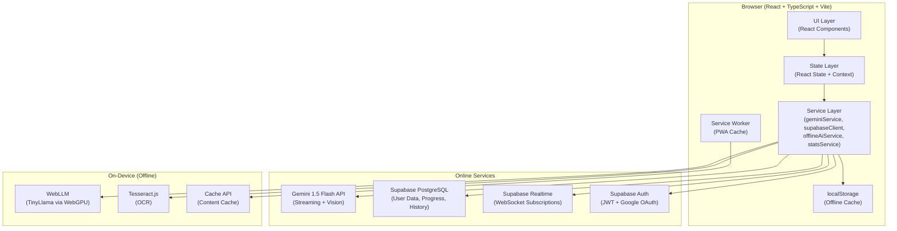

# Design Document: EduFree.AI Advanced

## Overview

EduFree.AI Advanced transforms the existing React/TypeScript/Supabase/Gemini web app into a fully real-time, AI-powered learning platform. The design extends the current architecture with Supabase Realtime subscriptions, streaming AI responses, adaptive quiz logic, a gamification engine, offline PWA support via WebLLM, and a live teacher monitoring dashboard.

The system is built on the principle of **graceful degradation**: every feature works online with full AI power, and degrades to a capable offline mode using on-device WebLLM when connectivity is lost.

---

## Architecture



### Key Architectural Decisions

1. **Supabase Realtime for live features**: All real-time updates (leaderboard, classroom, notifications) use Supabase's built-in WebSocket channels rather than a separate WebSocket server, keeping infrastructure minimal.

2. **Streaming-first AI**: All AI responses use `generateCoachResponseStream` (async generator) to stream tokens progressively. Non-streaming is only used as a fallback.

3. **Offline-first with sync queue**: When offline, mutations are queued in localStorage and flushed to Supabase when connectivity is restored.

4. **Service Worker for PWA**: A Vite PWA plugin generates the service worker and manifest, caching static assets and visited content pages.

---

## Components and Interfaces

### Component Tree

```mermaid
graph TD
    App --> AuthPage
    App --> Sidebar
    App --> Dashboard
    App --> ConceptCoach
    App --> DoubtSolver
    App --> ExamArena
    App --> LearningPath
    App --> TeacherDashboard
    App --> Leaderboard
    App --> OfflineBanner

    Dashboard --> LivePulse
    Dashboard --> StreakWarning
    Dashboard --> AIInsightsStream
    Dashboard --> LeaderboardWidget

    ConceptCoach --> ChatWindow
    ConceptCoach --> VoiceRecorder
    ConceptCoach --> LanguageSelector
    ConceptCoach --> OfflineModelLoader

    ExamArena --> QuizCard
    ExamArena --> TimerBar
    ExamArena --> ResultsScreen
    ExamArena --> DifficultyBadge

    TeacherDashboard --> StudentList
    TeacherDashboard --> StudentDetail
    TeacherDashboard --> BroadcastPanel
    TeacherDashboard --> ClassAnalytics
```



### Core Service Interfaces

```typescript
// Realtime subscription manager
interface RealtimeService {
  subscribeToLeaderboard(callback: (students: LeaderboardEntry[]) => void): () => void;
  subscribeToClassroom(teacherId: string, callback: (event: ClassroomEvent) => void): () => void;
  subscribeToStudentActivity(studentId: string, callback: (activity: ActivityEvent) => void): () => void;
  broadcastToClass(teacherId: string, message: BroadcastMessage): Promise<void>;
}

// XP and gamification engine
interface GamificationService {
  awardXP(studentId: string, activity: ActivityType, metadata?: object): Promise<XPResult>;
  checkMilestones(studentId: string, newXP: number, newStreak: number): MilestoneResult[];
  getRanking(studentId: string): Promise<RankInfo>;
  getLeaderboard(limit?: number): Promise<LeaderboardEntry[]>;
}

// Adaptive quiz engine
interface AdaptiveQuizEngine {
  generateQuiz(topic: string, difficulty: DifficultyLevel, count?: number): Promise<QuizQuestion[]>;
  processAnswer(sessionId: string, questionId: number, isCorrect: boolean): DifficultyUpdate;
  completeQuiz(sessionId: string): Promise<QuizResult>;
}

// Offline sync queue
interface SyncQueue {
  enqueue(operation: SyncOperation): void;
  flush(): Promise<SyncResult[]>;
  getPending(): SyncOperation[];
}
```

---

## Data Models

### Supabase Schema

```sql
-- Extended user profiles
CREATE TABLE profiles (
  id UUID PRIMARY KEY REFERENCES auth.users(id),
  name TEXT NOT NULL,
  email TEXT NOT NULL,
  avatar_url TEXT,
  role TEXT DEFAULT 'student' CHECK (role IN ('student', 'teacher')),
  xp INTEGER DEFAULT 0,
  streak INTEGER DEFAULT 0,
  last_activity_at TIMESTAMPTZ DEFAULT NOW(),
  preferred_language TEXT DEFAULT 'English',
  difficulty_level TEXT DEFAULT 'Beginner',
  created_at TIMESTAMPTZ DEFAULT NOW()
);

-- Quiz results
CREATE TABLE quiz_results (
  id UUID PRIMARY KEY DEFAULT gen_random_uuid(),
  student_id UUID REFERENCES profiles(id),
  topic TEXT NOT NULL,
  score INTEGER NOT NULL,
  total_questions INTEGER NOT NULL,
  time_taken_seconds INTEGER,
  difficulty TEXT NOT NULL,
  weak_areas TEXT[],
  xp_earned INTEGER DEFAULT 0,
  created_at TIMESTAMPTZ DEFAULT NOW()
);

-- Doubt history
CREATE TABLE doubt_history (
  id UUID PRIMARY KEY DEFAULT gen_random_uuid(),
  student_id UUID REFERENCES profiles(id),
  question_text TEXT NOT NULL,
  image_url TEXT,
  topic TEXT,
  solution JSONB,
  created_at TIMESTAMPTZ DEFAULT NOW()
);

-- Learning path nodes
CREATE TABLE learning_nodes (
  id UUID PRIMARY KEY DEFAULT gen_random_uuid(),
  student_id UUID REFERENCES profiles(id),
  subject TEXT NOT NULL,
  node_id TEXT NOT NULL,
  title TEXT NOT NULL,
  status TEXT DEFAULT 'LOCKED',
  completed_at TIMESTAMPTZ,
  created_at TIMESTAMPTZ DEFAULT NOW()
);

-- Classroom broadcasts
CREATE TABLE broadcasts (
  id UUID PRIMARY KEY DEFAULT gen_random_uuid(),
  teacher_id UUID REFERENCES profiles(id),
  message TEXT NOT NULL,
  created_at TIMESTAMPTZ DEFAULT NOW()
);

-- Achievements / badges
CREATE TABLE achievements (
  id UUID PRIMARY KEY DEFAULT gen_random_uuid(),
  student_id UUID REFERENCES profiles(id),
  type TEXT NOT NULL,
  title TEXT NOT NULL,
  xp_bonus INTEGER DEFAULT 0,
  earned_at TIMESTAMPTZ DEFAULT NOW()
);
```

### TypeScript Types (additions to types.ts)

```typescript
export interface LeaderboardEntry {
  id: string;
  name: string;
  avatar?: string;
  xp: number;
  streak: number;
  rank: number;
}

export interface RankInfo {
  rank: number;
  xpToNext: number;
  percentile: number;
}

export interface QuizSession {
  id: string;
  topic: string;
  difficulty: DifficultyLevel;
  questions: QuizQuestion[];
  answers: (number | null)[];
  startTime: number;
  consecutiveCorrect: number;
  consecutiveIncorrect: number;
}

export interface QuizResult {
  score: number;
  totalQuestions: number;
  timeTaken: number;
  xpEarned: number;
  weakAreas: string[];
  newDifficulty: DifficultyLevel;
}

export type DifficultyLevel = 'Beginner' | 'Intermediate' | 'Advanced';

export type ActivityType = 'quiz_complete' | 'concept_session' | 'doubt_solved' | 'streak_bonus' | 'node_complete';

export interface SyncOperation {
  id: string;
  type: 'upsert' | 'insert';
  table: string;
  data: object;
  timestamp: number;
}

export interface MilestoneResult {
  type: 'xp_milestone' | 'streak_badge';
  title: string;
  description: string;
  xpBonus: number;
}

export interface BroadcastMessage {
  id: string;
  teacherName: string;
  message: string;
  timestamp: number;
}

export interface ClassroomEvent {
  type: 'student_joined' | 'student_left' | 'broadcast';
  studentId?: string;
  data?: object;
}
```

---

## Correctness Properties

*A property is a characteristic or behavior that should hold true across all valid executions of a system — essentially, a formal statement about what the system should do. Properties serve as the bridge between human-readable specifications and machine-verifiable correctness guarantees.*

### Property-Based Testing Overview

Property-based testing (PBT) validates software correctness by testing universal properties across many generated inputs. Each property is a formal specification that should hold for all valid inputs.

The testing library used is **fast-check** (TypeScript/JavaScript PBT library). Each property test runs a minimum of 100 iterations.

---

### Property 1: XP Award Correctness
*For any* activity type and student, the XP awarded must exactly match the defined points table (quiz: 10 XP/correct answer, concept session: 25 XP, doubt solved: 15 XP, streak bonus: 50/150/500 XP).
**Validates: Requirements 7.1, 4.4**

---

### Property 2: Leaderboard Ranking Invariant
*For any* set of student XP values, the leaderboard must be sorted in descending order by XP, contain no duplicates, and the top-N slice must contain exactly the N highest-XP students.
**Validates: Requirements 7.2, 1.2**

---

### Property 3: Difficulty Adaptation — Upward
*For any* quiz session where the student answers 3 or more consecutive questions correctly, the resulting difficulty level must be one step higher than the starting difficulty (capped at Advanced).
**Validates: Requirements 4.2**

---

### Property 4: Difficulty Adaptation — Downward
*For any* quiz session where the student answers 2 or more consecutive questions incorrectly, the resulting difficulty level must be one step lower than the starting difficulty (floored at Beginner), and the topic must appear in the weak areas list.
**Validates: Requirements 4.3**

---

### Property 5: Quiz Score Calculation
*For any* set of quiz answers, the computed score must equal (number of correct answers / total questions) × 100, rounded to the nearest integer, and XP earned must equal correct answers × 10.
**Validates: Requirements 4.4**

---

### Property 6: Milestone Detection
*For any* XP value or streak count that crosses a defined threshold (XP: 500, 1000, 2500, 5000; Streak: 7, 14, 30 days), the milestone detection function must return the correct milestone with the correct XP bonus. For values that do not cross a threshold, no milestone should be returned.
**Validates: Requirements 7.3, 7.4**

---

### Property 7: Offline Mode Routing
*For any* AI request made when `navigator.onLine` is false, the system must route to the WebLLM offline service and must not attempt to call the Gemini API.
**Validates: Requirements 2.6, 8.3**

---

### Property 8: Streaming Response Completeness
*For any* valid prompt sent to the AI coach streaming function, the concatenation of all yielded chunks must equal the complete response text, and the generator must yield at least one chunk before completing.
**Validates: Requirements 2.1, 3.2**

---

### Property 9: Audio Base64 Round-Trip
*For any* audio Blob, converting to base64 via `blobToBase64` and then decoding back must produce a byte array of the same length as the original Blob.
**Validates: Requirements 2.2**

---

### Property 10: Streak Warning Threshold
*For any* student's last activity timestamp, the streak warning banner must appear if and only if the elapsed time since last activity is strictly greater than 20 hours.
**Validates: Requirements 1.4**

---

### Property 11: At-Risk Classification
*For any* student with an average quiz score strictly less than 50%, the student's status must be classified as "At Risk". For any student with an average score of 50% or above, the status must not be "At Risk".
**Validates: Requirements 6.2**

---

### Property 12: Learning Node Unlock
*For any* learning path graph and any node completion event where the quiz score is ≥ 70%, all direct successor nodes of the completed node must transition from "LOCKED" to "UNLOCKED". Nodes that are not direct successors must remain unchanged.
**Validates: Requirements 5.2**

---

### Property 13: Text Direction Detection
*For any* language selection, the text direction function must return "rtl" for Urdu and "ltr" for all other supported languages (English, Hindi, Hinglish, Tamil, Telugu).
**Validates: Requirements 9.3**

---

### Property 14: Language Preference Persistence
*For any* language selection, after calling the persist function, reading the language from localStorage must return the same language value.
**Validates: Requirements 9.2**

---

### Property 15: Protected Route Guard
*For any* route in the protected routes list, attempting to render it without a valid auth session must result in a redirect to the AuthPage, regardless of the route path.
**Validates: Requirements 10.5**

---

### Property 16: OCR Confidence Threshold
*For any* OCR result with a confidence score strictly less than 60, the Doubt_Solver must enter the "low quality" error state and must not proceed to the solution step.
**Validates: Requirements 3.4**

---

### Property 17: Offline Cache Completeness
*For any* set of recent data (learning path, chat messages, quiz results), after calling the cache function, reading from localStorage must return data that is structurally equivalent to the original.
**Validates: Requirements 8.5**

---

### Property 18: Class Analytics Correctness
*For any* set of student quiz results, the computed class average score must equal the arithmetic mean of all individual scores, and the most common weak area must be the topic appearing most frequently in weak area lists.
**Validates: Requirements 6.4**

---

## Error Handling

### AI Service Errors
- Gemini API failure → retry once with fallback model (`gemini-pro`) → if still failing, switch to WebLLM offline mode → if WebLLM unavailable (no WebGPU), display a user-friendly error with retry button.
- WebLLM initialization timeout (> 30 seconds) → cancel and display "Offline AI unavailable on this device" with option to retry online.

### Network Errors
- Supabase write failure while offline → enqueue in `SyncQueue` (localStorage) → retry on reconnect.
- Supabase Realtime disconnection → auto-reconnect with exponential backoff (1s, 2s, 4s, max 30s).

### OCR Errors
- Tesseract.js failure → display "Could not read image" with retry option.
- Low confidence (< 60%) → prompt user to retake photo with guidance tips.

### Auth Errors
- Expired session → clear local state → redirect to AuthPage with `?redirect=<current_path>`.
- OAuth failure → display specific error message from Supabase Auth error codes.

### Quiz Errors
- Gemini quiz generation failure → use a pre-built fallback question bank stored in localStorage.
- Timer edge case (tab hidden) → pause timer when `document.visibilityState === 'hidden'`, resume on focus.

---

## Testing Strategy

### Dual Testing Approach

Both unit tests and property-based tests are required. They are complementary:
- **Unit tests** verify specific examples, edge cases, and integration points.
- **Property tests** verify universal correctness across all inputs.

### Testing Framework
- **Unit tests**: Vitest + React Testing Library
- **Property-based tests**: fast-check (minimum 100 iterations per property)
- **Test files**: Co-located with source using `.test.ts` / `.test.tsx` suffix

### Property Test Annotation Format
Each property test must include a comment:
```
// Feature: edufree-ai-advanced, Property N: <property_text>
```

### Coverage Targets
- All 18 correctness properties must have a corresponding property-based test.
- All service functions must have unit tests covering happy path, error path, and edge cases.
- All React components must have unit tests for rendering and user interaction.

### Test Organization
```
services/
  gamificationService.test.ts     (Properties 1, 2, 6)
  adaptiveQuizEngine.test.ts      (Properties 3, 4, 5)
  offlineService.test.ts          (Properties 7, 17)
  geminiService.test.ts           (Properties 8, 9)
  realtimeService.test.ts         (Properties 11, 18)
  authService.test.ts             (Property 15)
components/
  Dashboard.test.tsx              (Property 10)
  DoubtSolver.test.tsx            (Property 16)
  LearningPath.test.tsx           (Property 12)
  ConceptCoach.test.tsx           (Properties 13, 14)
```
